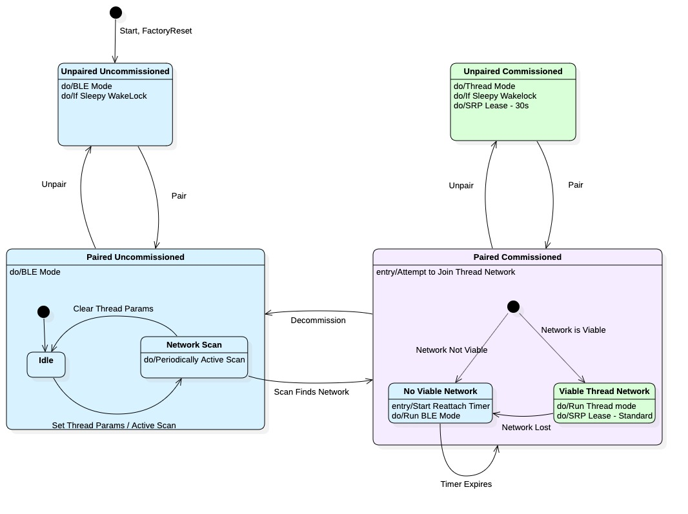

Thread Use Cases
================

This document describes the Use Cases a Thread Accessory is expected to provide.

## Accessory States

- *Commissioned*:  A Thread Accessory is *Commissioned* if it has received Thread Network Credentials.
- *Paired*:  A Thread accessory is paired if it has at least one pairing from a HAP Controller. This pairing could
have been performed over BLE; the accessory is still *Paired*.
- *Detached*:  A Detached Thread accessory is one that has been *commissioned* but cannot find a *Viable* Thread
Network corresponding to its Network Credentials to join.

### Definitions

- *Viable*:  A Thread network is *Viable* if it contains at least one Border Router and serves at least one instance
of srp-mdns-proxy.
- *Joiner Mode*:  A mode of operation that allows an Accessory to be commissioned via the Thread Network.

## Thread & BLE Accessories
A HAP controller may communicate with an accessory over either BLE or Thread transport protocol but not over both.
Accessories do not advertise over BLE while Thread transport is up.

- *Uncommissioned*: An *Uncommissioned* Accessory operates in BLE mode.
- *Commissioned*: A *Commissioned* Accessory operates in one of two modes.

#### Thread Mode
- Upon becoming *Commissioned* The accessory initiates [Attach to Thread Network Flow](#attach-to-thread-network).
- If successful, the Accessory will be reachable via Thread.

#### BLE Fallback Mode
- If unsuccessful, or if the Thread Network is [Lost](#lost-thread-network) the *Commissioned* accessory falls back
to BLE.
- Accessories operating in BLE Fallback mode periodically attempt to perform the
[Thread Attach](#attach-to-thread-network) flow to reconnect to their Thread Network.
- This continues until the network is found or the accessory is [Decommissioned](#decommissioning).

##### Alternate Flow - Unpaired
An accessory that is *Unpaired* but also *Commissioned*, which can happen when the last pairing is removed, will
perform the same actions with the following exceptions:

- Sleepy *Unpaired Commissioned* Accessories will not enter sleep mode to facilitate pairing.

### Pairing
There are two methods of Pairing. Over BLE or over Thread.

##### Standard Flow

- Accessory is in BLE mode
- User initiates Pairing by scanning QR code or entering setup id.
- Controller Pairs with accessory over BLE.
- Controller Commissions the Accessory over BLE via the [Commissioning Flow](#commissioning)
- This transitions the Accessory to Thread Mode. The controller will now interact with the accessory over Thread.

##### Alternative Flow - Accessory is in Thread Mode
This can happen if an Accessory is currently *Commissioned* and *Unpaired*  See [Unpaired](#alternate-flow---unpaired).

- Accessory is in Thread Mode, and is attached to a *Viable* Thread Network.
- User initiates Pairing by scanning QR code.
- Controller Pairs with accessory over Thread.

### Commissioning
Thread/BLE accessories may only be commissioned over BLE. Once commissioned the accessory will attempt to transition
to Thread.

##### Standard Flow

- Thread Network Credentials are sent to the Thread Accessory over BLE.
- The Thread Accessory performs an Active Scan to find a thread network with matching credentials.
- Upon finding a matching network, the Thread Accessory commits the credentials and is now *Commissioned*.
- The Thread Accessory initiates the [Attach to Thread Network](#attach-to-thread-network) flow.
- The Thread Accessory disables BLE and is now only reachable over Thread.

##### Alternative Flow - Failure to find Thread Network in Scan
When the Thread Network cannot be found with an active scan within a specified period of time (Currently set to 65
seconds).

- The Accessory remains in BLE mode.
- The accessory periodically performs the Active Scan to find a Thread Network matching the credentials provided.
- If a matching network is found during these scans, the Thread Accessory commits the credentials and is now
*Commissioned*.
- The Thread accessory then initiates the [Attach to Thread Network](#attach-to-thread-network) flow.
- If successful, the Accessory disables BLE and is now only reachable over Thread.

##### Alternative Flow - Attach To Thread Network flow fails
Once the Active Scan has been successfully performed the Thread Accessory is *Commissioned*, but that does not mean
it can use the Thread Network. If the network is not *Viable*, the Attach will fail.

- The Thread Accessory will continue to operate in BLE mode.
- As a commissioned device, the Accessory will periodically reattempt the
[Attach to Thread Network](#attach-to-thread-network) flow.
- If rebooted The Thread Accessory will perform the [Commissioned](#commissioned) flow.

### Decommissioning

- Controller initiates decommissioning by sending a "Clear Thread Credentials" command to the Thread Accessory.
- Thread Accessory erases all thread network credentials.
- Thread Accessory disables Thread and returns to BLE mode. The Accessory is no longer *Commissioned*.

### Attaching to Thread Network

##### Standard Flow

- The Accessory will join the commissioned Thread Network.
- The Accessory will verify that the Thread Network it has joined is *Viable*. A Thread network is Viable if it has
a border router and srp-mdns-proxy.
- The accessory disables BLE and Transitions to Thread completely.
- The accessory sends its advertisement to the MDNS Proxy.

##### Alternative Flow: Network is not Viable
- If the Thread Network does not have a Border Router or is serving srp-mdns-proxy it is not *Viable*.
- The accessory will enter a The accessory will refuse to join a network that is not *Viable*, and will return to
BLE mode.
- As long as the Accessory is *Commissioned* it will periodically reattempt the
[Attach to Thread Network](#attach-to-thread-network) flow.

### Lost Thread Network
- Accessory is notified that the Thread Network is no longer *Viable*. This means either that it has lost a
connection to its Parent and cannot attach to any other, the Border Router can no longer be found on the network, or
srp-mdns-proxy is no longer served by the network.
- Accessory will enter a grace period (currently lasting 65 seconds) to see if the accessory can reattach to the
network.
- Upon expiration of the grace period the Accessory will return to BLE operation and exit Thread mode.
- As long as the Accessory is *Commissioned*, it will periodically reattempt the
[Attach to Thread Network](#attach-to-thread-network) flow.

### Factory Reset
Factory Reset clears all parameters, Pairings, and Commissioned Thread Network Credentials.

- Factory Reset is initiated.
- *Pairings* are removed.
- The Accessory is [Decommissioned](#decommissioning).
- The Accessory is rebooted. It will boot into the [Uncommissioned](#uncommissioned) flow.

## Thread Only Accessories
Some accessories may not support BLE. These accessories do not transition between BLE and Thread modes.

### Thread Only Uncommissioned Idle
Uncommissioned Accessories immediately attempt to join a Thread Network.

- Accessory enters Joiner-Mode to look for Thread Networks.
- Accessory repeats Joiner-Mode until successful [Commissioning](#thread-only-commissioning) is completed.

Note:  Sleepy Devices will prevent themselves from going to sleep while *Uncommissioned* and *Unpaired* to
facilitate Network Join and Pairing.

### Thread Only Commissioned Idle

- A *Commissioned* Thread Accessory will attach to its Thread Network. It does not check whether the network is
*Viable* because there is no BLE to fall back to.

##### Alternate Flow: Lost Network
If a *Commissioned* and *Paired* Thread only Accessory loses its Thread network it will enter the *Detached* state.
It will remain in this state until [Factory Reset](#thread-only-factory-reset) or the Thread Network is recovered.

### Pairing
Native Thread pairing is performed as follows:

- User initiates Pairing by scanning QR code.
- Controller commissioned the accessory via the [Commissioning Flow](#thread-only-commissioning).
- Controller pairs with the accessory over Thread.

### Thread Only Commissioning
- Thread Accessory enters *Joiner-Mode*.
- Controller initiates a Commissioner - Add using the Accessory's EUI and Passphrase (Provided via QR Code).
- Accessory is provided Thread Network Credentials from the Thread Network directly. Accessory is now *Commissioned*.
- Accessory attaches to the Thread Network.

### Thread Only Decommissioning
- Thread Accessory leaves the Thread Network.
- Thread Accessory erases all Thread Network credentials.
- Thread Accessory returns to [Uncommissioned](#thread-only-uncommissioned-idle).

### Thread Only Factory Reset
Factory Reset clears all parameters, Pairings, and Commissioned Thread Network Credentials.

- Factory Reset is initiated.
- *Pairings* are removed.
- The Accessory is [Decommissioned](#thread-only-decommission).
- The Accessory is rebooted. It will boot into the [Uncommissioned](#thread-only-uncommissioned-idle) flow.

### Unpairing and Unpaired Advertising
By default, if an ADK Application is on a Thread Network and its last pairing is removed, it will remain
on the Thread Network and begin advertising as unpaired on that network to facilitate pairing over that
Thread Network. However, for some devices, especially devices relating to security, this may not be desirable.

For this reason, the Thread HAP Accessory Server Options structure defines suppressUnpairedThreadAdvertising.
Example code will set this option to true by using the following command:

make PROTOCOLS=THREAD HAP_THREAD_DECOMMISSION_ON_UNPAIR=1 apps

If this option is set to true, it will ensure the ADK Accessory does not advertise itself as unpaired over
the Thread Network. This allows an ADK Application to handle several use cases, including but not limited to:

- Purposely transition to BLE, *and/or*
- Stop the Thread Transport, *and/or*
- Decommission from the Thread Network, *and/or*
- Stop the entire ADK Accessory Server, *and/or*
- Execute any other necessary Application/Hardware specific logic related to unpairing before refreshing the Thread Advertisement

## State Diagram
The following state diagram describes the general behavior of Thread/BLE devices.

