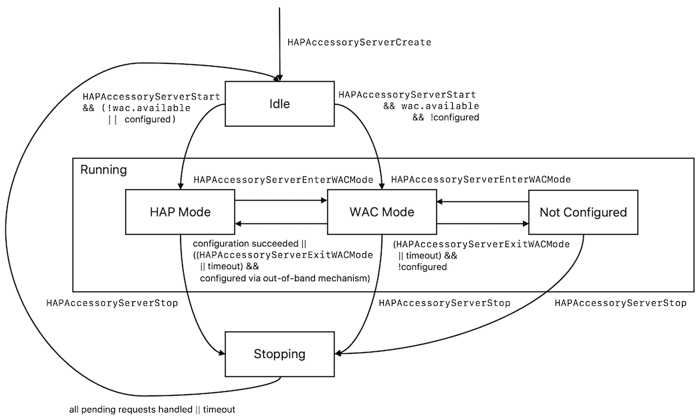

Accessory Pairing
=================

## Pairing

A HomeKit controller can only use a HomeKit accessory after it has been paired with it. A new HomeKit accessory, or an
accessory that has been factory reset, is not paired with any HomeKit controller. An accessory can be paired after it
has been powered on. A Wi-Fi accessory needs to be in [WAC Mode](#wi-fi-accessory-configuration) for pairing, or must be
added to the Wi-Fi network out-of-band.

If an accessory has a display that supports showing a setup code, a random setup code is used while pairing. Note that
for displays that support showing a scannable QR code it is still necessary to provision each accessory with a unique
setup ID during manufacturing. This setup ID is used for identifying the accessory. The ADK will call the
`HAPPlatformAccessorySetupDisplay` function for updating the setup code, and when the pairing is started and stopped.

If the accessory has a programmable NFC tag, accessory setup information may be exchanged over NFC. The platform
`HAPPlatformAccessorySetupNFC` function must be implemented if the accessory has a programmable NFC tag.

- Programmable NFC requires the accessory to be provisioned with a setup ID. If no display is available, the raw setup
code must also be provisioned.
- In contrast to displays that are activated automatically when a pairing request is registered, programmable NFC is
only available after explicitly calling `HAPAccessoryServerEnterNFCPairingMode`.
- The accessory must require users to explicitly trigger NFC pairing mode via a physical interaction on the accessory.
- Accessories implementing programmable NFC must not implicitly be ready to pair once all pairings have been removed.

For debugging the pairing behavior of IP accessories, it can be helpful to observe the Bonjour TXT status flags
(see also *Table 6-9 Bonjour TXT Status Flags in the HAP specification*) using a Bonjour browser app such as Discovery
from the App Store. These flags, which are broadcast over the IP network, are also shown in the ADK log output:

- The value of *sf* should be *1* if the accessory is not paired. In this case, the accessory should be visible in the
Add accessory screen of the HomeKit controller.
- The value of *sf* should be *0* if the accessory is paired.

For accessories that support displays or programmable NFC, it is the accessory manufacturer’s responsibility to provide
an appropriate mechanism for entering this special mode. The mechanism must require physical presence of a user, so that
no remote attacks can cause the pairing mode to be entered. Typically, a dedicated hardware button is provided that
enables NFC pairing for a limited time.

The following is required for licensed accessories:
- The accessory must require users to explicitly trigger NFC pairing mode via a physical interaction.
- Accessories implementing programmable NFC must not implicitly be ready to pair once pairing is removed.

``` Note::
    When the user initiates a manual pairing in the Home app’s accessory browser (list of unpaired HomeKit accessories),
    the HAP Library automatically enters the pairing mode without further user intervention. This behavior must be
    modified for programmable NFC tags when going through production to require user interaction in this case, i.e.,
    by not running `HAPAccessoryServerStart` until the user triggers NFC pairing mode.
```

``` Note::
    The NFC pairing mode is triggered automatically after every power cycle (switching accessory off and on again).
    This workaround is only intended for testing and debugging. For actual products, the pairing mode has to be
    implemented by the accessory logic. The samples by default turn on pairing mode for the first few minutes after
    power on, however that behavior can be changed easily in the AppBase.c / App.c files. It is expected that licensees
    adjust the code so that pairing mode is wired to a physical button instead of simply being present upon power on.
```

Currently applicable to Wi-Fi Routers only: ADK 3.0 onwards includes support for ownership proofs. When an accessory is
paired through a non-HomeKit mechanism, ownership proof can be used to restrict HomeKit pairing to users who have the
necessary privileges in said non-HomeKit system. Ownership proof requires an accessory app that can obtain a software
token from the accessory which proves that the user is authorized to perform HomeKit pairing. Please refer to the
documentation of the APIs `HAPAccessoryServerSetOwnershipProofTokenRequired` and
`HAPAccessoryServerGenerateOwnershipProofToken` in `HAP.h`.

Example flow:
1. User requests HomeKit pairing in accessory app.
2. Accessory app communicates with the accessory and verifies that the user is authorized for HomeKit pairing.
3. Accessory generates ownership proof token using `HAPAccessoryServerGenerateOwnershipProofToken`.
4. Accessory app obtains the generated ownership proof token from the accessory.
5. Accessory app provides the ownership proof token using `[HMAccessorySetupPayload initWithURL:ownershipToken:]`.
6. Accessory app requests HomeKit pairing using `[HMHome addAndSetupAccessoriesWithPayload:completionHandler:]`.
7. During the HomeKit pairing process, the app-provided ownership proof token is sent to the accessory.
8. Accessory verifies that the received ownership proof token matches the one generated earlier.
9. After HomeKit pairing completes, user gains HomeKit admin privileges.

## Wi-Fi Accessory Configuration

A HomeKit Wi-Fi accessory that has not been used yet, or has been reset to factory settings, has no information on how
to join the owner’s Wi-Fi network, i.e., no network name (SSID) nor the password. HomeKit uses the *WAC2* protocol to
provide this information to the accessory during pairing, without the user having to enter the information manually.

The WAC process goes through several states. Knowing them can help during testing of an accessory. The following diagram
shows the WAC state machine as implemented in the ADK:



- Idle state:
An unpaired accessory goes into the Idle state after booting up and after HAPAccessoryServerCreate has been called by
the accessory logic. This is the only state in which the accessory logic is allowed to call HAPAccessoryServerStart,
which transitions the accessory into the Running state.

- Running state:
The Running state has three sub-states: HAP Mode, WAC Mode and Not Configured. If the Wi-Fi credentials are already
configured, which might have happened with some mechanism other than WAC on accessories that do not only support
HomeKit, or if the accessory logic has set the `ip.wac.available` flag in the `HAPAccessoryServerOptions` to false, the
accessory enters HAP Mode when started.
    - HAP Mode sub-state is the normal operational state when an accessory is running.
    - WAC Mode sub-state is entered automatically when the server has been created for an un-configured accessory, or
    when a user requests it explicitly: typically via a hardware button. If no successful configuration occurs for 15
    minutes, the accessory goes into the Not Configured mode, otherwise into HAP Mode. An accessory’s user interface may
    also allow the user to explicitly exit WAC Mode, e.g., by pressing the WAC button again.
    - Not Configured sub-state is entered after 15 minutes if no successful configuration occurred. The user can request
    the accessory to re-enter WAC Mode.

- Stopping state:
When `HAPAccessoryServerStop` is called by the accessory logic, the accessory enters the Stopping state. In this state,
pending HAP requests are processed, but no new requests are accepted anymore. A timeout ensures that the Idle state is
entered eventually even if outstanding requests cannot be completed for some reason.

Some remarks regarding the accessory server functions:

- `HAPAccessoryServerStop` may be called anytime after `HAPAccessoryServerCreate`. It always causes a state transition
to Stopping if not in Idle, or it remains idle if already in Idle state. This can be useful e.g. for setting up the
Wi-Fi credentials through some other mechanism, see below.
- `HAPAccessoryServerStart` may only be called in Idle state, otherwise a precondition check fails.
- `HAPAccessoryServerEnterWACMode` may be called anytime after `HAPAccessoryServerCreate`. It has no effect, except if
in HAP Mode, where it deletes the Wi-Fi credentials and transitions to WAC Mode.
- `HAPAccessoryServerExitWACMode` may be called anytime after `HAPAccessoryServerCreate`. It has no effect, except if
in WAC Mode, where it transitions to HAP Mode or Not Configured, depending on whether or not the Wi-Fi network has been
configured in the meantime by an out-of-band mechanism.
- `HAPAccessoryServerIsInWACMode` indicates whether the accessory is currently in the WAC Mode sub-state of state
Running. Relevant state changes are also signaled through the `HAPAccessoryServerCallbacks.handleUpdatedState` callback.
Also refer to `HAPAccessoryServerGetState`.

``` Note::
    If a Wi-Fi configuration has been applied through an out-of-band mechanism (not via WAC), it is necessary to call
    ``HAPAccessoryServerExitWACMode``. The accessory server will then enter normal HAP mode.
```
