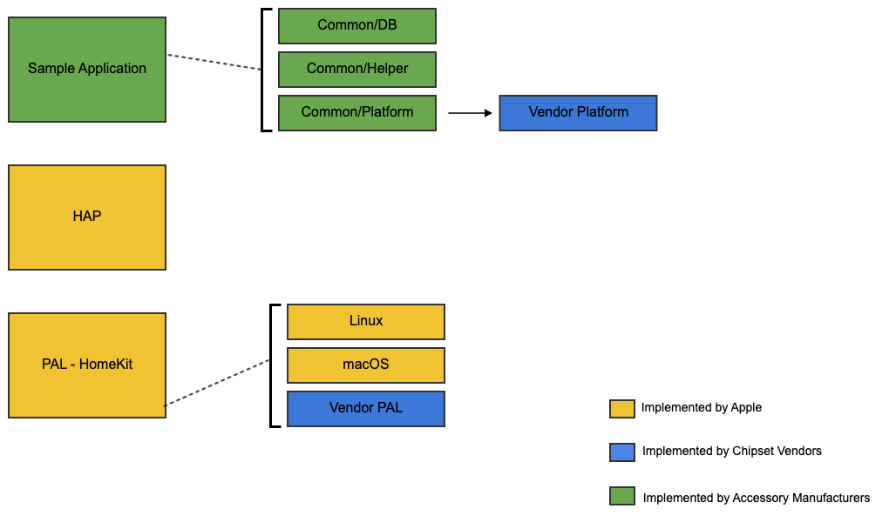

ADK Architecture
================
This section provides an overview of HomeKit ADK.



The ADK accessory consists of three major elements: the *accessory logic*, the *HAP Library*, and the *PAL interface*.
The HAP Library implements the HomeKit Accessory Protocol. It is a software layer that resides between the accessory’s
application layer software (e.g., control software for a ceiling fan) and the target platform (e.g., a custom-designed
Linux device).

## Accessory Logic
The accessory logic contains the application-layer code of an accessory. It is written by an accessory manufacturer,
using their particular domain expertise, such as heating and cooling of rooms for thermostat accessories, or audio/video
processing for IP camera accessories. The ADK contains samples for light bulb, thermostat, door lock, camera, HomeKit
bridge accessories etc.

## HAP Library
The HAP API, defined by Apple, allows developers to declare the services and characteristics of the accessory. After
initialization of the target platform, the HomeKit accessory server which handles all HAP communication over IP, BLE or
Thread can be started. When a request comes in (e.g., a request from an iPhone to change the set point of a thermostat)
the HAP Library calls the suitable function pointers provided during the declaration of the services. As these calls go
from the HAP Library "upwards" into the accessory logic, they are called upcalls. Upcalls issued by the HAP Library never
overlap in order to avoid hard-to-find multithreading issues, to make it easy to integrate the HAP Library with other
code, and to make the library usable even on “bare metal” systems without operating system and multithreading support.
The HAP API is simple, and flexible enough to support custom characteristics and services in addition to the
Apple-defined HomeKit profiles.

Apple provides an up-to-date implementation of the HAP Library. It implements the HAP pairing, session, and security
protocols. The single-threaded design of the HAP Library makes it easy to integrate into different environments
(e.g., into device software that already exists and uses a proprietary cloud service for data storage).

## PAL Interface
The API of the Platform Abstraction Layer is defined by Apple but unlike the HAP API, it is not implemented by Apple.
It is used by the HAP Library, and must be implemented in a PAL by a platform developer. The PAL API is highly modular
and supports mechanisms including timers, persistent storage, random number generator, and more. It is designed to
provide abstractions for every service that the HAP Library needs, in a way that enables easy implementation with
minimal overhead.

``` Note::
    HomeKit ADK comes with sample Platform implementations for *Linux*, *Raspberry Pi*, *nRF52* and *macOS*.
    Chipset vendors are expected to provide a platform implementation for their respective platforms. Sample PAL
    implementations cannot be assumed to be directly usable “as is”.
```

## ADK RunLoop
All API functions of HAP and PAL must be called from the ADK run-loop thread only using the API `HAPPlatformRunLoopScheduleCallback`,
unless otherwise explicitly specified in the API documentation.

The following are the well known exceptions:

- `HAPLog` macros. The macros can be called from any thread.
- `HAPAssert()`, `HAPPrecondition()` and `HAPFatalError()`.
