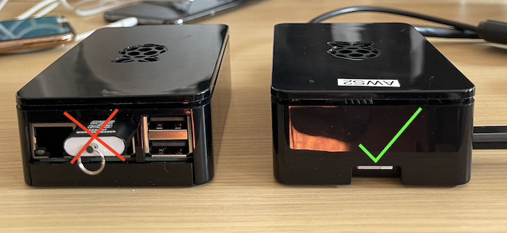

Raspberry Pi Setup Guide
========================

This guide gets you started on setting up a Raspberry Pi to run an ADK application. Before you get started, please make
sure to go through [Getting started with ADK](./getting_started.md) to set up your development environment.

1. [Hardware Required](#hardware-required)
2. [Setup Instructions](#setup-instructions)
3. [BLE Setup](#ble-setup)
4. [Troubleshooting](#troubleshooting)

## Hardware Required
- Raspberry Pi 3B+ or Raspberry Pi 4
- USBC → Ethernet Adaptor or USB → Ethernet Adaptor

## Setup Instructions

To use Raspberry Pi you must setup an SD card first with a Raspberry Pi OS image along with additional dependencies
required by the ADK.

- Open Terminal and change directory into the `ADK/Tools` directory:

  ```sh
  cd ADK/Tools
  ```

- Run the following shell command to begin the Raspberry Pi SD card setup process

  ```sh
  ./raspi_sdcard_setup.sh
  ```

- Insert the MicroSD card into the MicroSD reader and plug it into your Mac and hit *Return*.
- You will see an output of disk targets. Type in the SD card drive number. In the example below, it would be
`/dev/disk2`.

  ```sh
  ================================================================================
  /dev/disk0 (internal, physical):
    #:                       TYPE NAME                    SIZE       IDENTIFIER
    0:      GUID_partition_scheme                        *248.9 GB   disk0
    1:                        EFI EFI                     314.6 MB   disk0s1
    2:                 Apple_APFS Container disk1         247.5 GB   disk0s2
    3:       Apple_KernelCoreDump                         1.1 GB     disk0s3

  /dev/disk1 (synthesized):
    #:                       TYPE NAME                    SIZE       IDENTIFIER
    0:      APFS Container Scheme -                      +247.5 GB   disk1
                                   Physical Store disk0s2
    1:                APFS Volume 19G73                   13.9 GB    disk1s1
    2:                APFS Volume 19G73 - Data            17.4 GB    disk1s2
    3:                APFS Volume Preboot                 81.9 MB    disk1s3
    4:                APFS Volume Recovery                542.1 MB   disk1s4
    5:                APFS Volume VM                      2.1 GB     disk1s5

  /dev/disk2 (external, physical):
    #:                       TYPE NAME                    SIZE       IDENTIFIER
    0:     FDisk_partition_scheme                        *32.0 GB    disk2
    1:             Windows_FAT_32 CANAKIT                 32.0 GB    disk2s1

  ================================================================================
  Please type in Raspberry Pi SD card device name, or press enter to refresh disk list.
  /dev/disk2
  ```
- Enter `y` when asked if you want to erase the disk. Authenticate to begin flashing the image to the SD card.

  ```sh
  Erase this disk: `/dev/disk2`? [y/N]y

  ==============================================================
  + diskutil unmountDisk /dev/disk2
  Unmount of all volumes on disk2 was successful
  + sudo diskutil eraseDisk FAT32 RASPBIAN MBRFormat /dev/disk2
  Password:
  Started erase on disk2
  ```

- When prompted, remove the SD card from your Mac, insert the SD card into your Raspberry Pi.<details>
  <summary>Expand to see Raspberry Pi SD card slot</summary>

  
  </details>

- You would need to connect your Raspberry Pi to your mac using ethernet cable before you proceed. Following
instructions to [connect Raspberry Pi to mac using internet sharing](https://medium.com/@tzhenghao/how-to-ssh-into-your-raspberry-pi-with-a-mac-and-ethernet-cable-636a197d055).
Once the ethernet cable is plugged into the Raspberry Pi and connected to your Mac, hit *Return*. This will start
running configuration scripts.

- Following are the default configurations unless changed during setup:
  - Wi-Fi Country Code: `US`
  - Host name: `raspberrypi`
  - User name: `pi`
  - Password: `raspberry`

## BLE Setup
BLE support on Raspberry Pi is optional and is only required if using Raspberry Pi as a BLE HomeKit accessory.

<details>
  <summary>Expand to follow instructions to setup BLE</summary>
<BR>

  By default, the BlueZ stack on Raspberry Pi is not compatible with HomeKit. A script is available for MFi partners to
  address the HomeKit compatibility issues with Raspberry Pi bluetooth stack.

  Run the following on your development machine to address these issues with the bluetooth stack on Raspberry Pi:

  ```sh
  ./Tools/raspi_bluez_install.py -n raspberrypi -p <password>
  ```

  ``` Important::
      Each time Raspberry Pi is rebooted, you have to restart bluetooth service. This seems to be related to a known
      issue: https://github.com/RPi-Distro/pi-bluetooth/issues/8. The problem will affect pairing the Raspberry Pi
      accessory with Home Application.

      Following command can be run on Raspberry Pi to restart bluetooth stack after every reboot:

      .. code-block:: bash

         sudo systemctl restart bluetooth

  ```

</details>
<BR>

## Troubleshooting
<details>
  <summary>Change the default country code</summary>
<BR>

  The default image uses `US` for wifi country code. If you need to change this, you can do so by logging into the
  Raspberry Pi using the command below.

  ```sh
  sudo raspi-config
  ```

</details>
<BR>

<details>
  <summary>Setup Wi-Fi</summary>
<BR>

  Run command `sudo raspi-config` and then go to `network options` > `Wi-fi` and enter SSID and password. Refer to
  [Setting up a wireless LAN via CLI](https://www.raspberrypi.org/documentation/configuration/wireless/wireless-cli.md)
  for more details.

  ```sh
  sudo raspi-config
  ```
</details>
<BR>

<details>
  <summary>Change Timezone</summary>
<BR>

  To set the local time zone on Raspberry Pi to match your current time zone, do the following:

  - ssh to the raspberry pi
  - run `sudo raspi-config`
  - Select *Localization Options*
  - Select *Change Timezone*
  - Select your timezone to match your other devices
    - Example: if you are in *Cupertino* or America-Pacific timezone, select *America* then *Los Angeles*
  - Select *Finish*

</details>
<BR>
