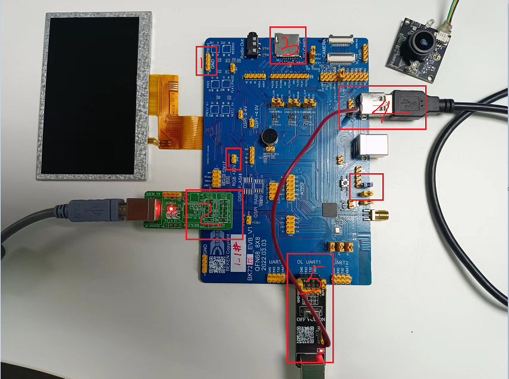
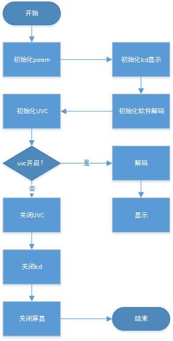
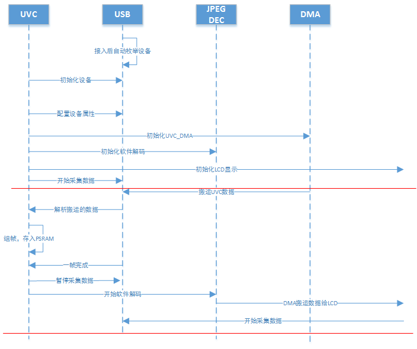

UVC 屏显 demo
========================

:link_to_translation:`en:[English]`

1 功能概述
-------------------------

	UVC屏显将USB camera采集的图像信息，经过其内部的ISP模块编码后，再由软件解码，最后实时的显示到RGB屏幕上。

2 代码路径
-------------------------------------
	demo路径：``./components/demos/media/video/uvc_capture_display``

3 cli命令简介
-------------------------------------
	demo支持的命令如下表：

	+----------------------------------------+--------------------------+----------------------+
	|             Command                    |      Param               |   Description        |
	+========================================+==========================+======================+
	| cpu1 uvc cpu1_init                     | 无                       +初始化cpu1 uvc mailbox|
	+----------------------------------------+--------------------------+----------------------+
	| uvc cpu0_init                          | 无                       |初始化cpu0 uvc mailbox|
	+----------------------------------------+--------------------------+----------------------+
	| uvc init param1 param2 param3          | param1:width             |图像的宽度            |
	|                                        +--------------------------+----------------------+
	|                                        | param2:height            |图像的高度            |
	|                                        +--------------------------+----------------------+
	|                                        | param3:frame_rate        |图像的帧率            |
	+----------------------------------------+--------------------------+----------------------+
	|                                        | param1:width             |图像的宽度            |
	|                                        +--------------------------+----------------------+
	| uvc display_init param1 param2 param3  | param2:height            |图像的高度            |
	|                  param4                +--------------------------+----------------------+
	|                                        | param3:frame_rate        |图像的帧率            |
	|                                        +--------------------------+----------------------+
	|                                        | param4:lcd interface     |屏幕类型1-8080,2-RGB  |
	+----------------------------------------+--------------------------+----------------------+
	| uvc start                              | 无                       |uvc开始传输           |
	+----------------------------------------+--------------------------+----------------------+
	| uvc capture                            | 无                       |uvc拍照               |
	+----------------------------------------+--------------------------+----------------------+
	| uvc stop                               | 无                       |uvc停止传输           |
	+----------------------------------------+--------------------------+----------------------+
	| uvc deinit                             | 无                       |uvc和cpu1 mailbox释放 |
	+----------------------------------------+--------------------------+----------------------+
	| uvc cpu0_init                          | 无                       |cpu0 mailbox释放      |
	+----------------------------------------+--------------------------+----------------------+

	demo运行依赖的宏配置：
	
	+--------------------------------------+------------------------+----------------------------------------------------+---------+
	|                 NAME                 |      Description       |                      File                          |  value  |
	+======================================+========================+====================================================+=========+
	|CONFIG_USB_HOST                       |配置是否支持usb host    |``properties\soc\bk7256_cp1\bk7256_cp1.defconfig``  |    y    |
	+--------------------------------------+------------------------+----------------------------------------------------+---------+
	|CONFIG_USB_UVC                        |配置是否支持把uvc       |``properties\soc\bk7256_cp1\bk7256_cp1.defconfig``  |    y    |
	+--------------------------------------+------------------------+----------------------------------------------------+---------+

4 演示介绍
-------------------------------------
	demo执行的步骤如下：
	
	1、准备好uvc摄像头，屏幕显示为RGB屏幕，连接方式如下图所示：
	
	2、顺序发送下面命令：
	
		cpu1 uvc cpu1_init
		
		uvc cpu0_init
		
		uvc display_init 640 480 20 2
		
		uvc start
		
		uvc stop
		
		uvc deinit
		
		uvc cpu0_deinit
		

    Figure 1. uvc屏显时板子的连接示意

5 详细配置及其说明
-------------------------------------
	1、显示初始化说明：uvc display_init param1 param2 param3 param4
	
	param1和param2表示USB枚举到摄像头支持的分辨率的宽度和高度。
	
	param3表示UVC支持的帧率，可调范围由UVC本身决定，5、10、15、20、25、30。
	
	param4表示RGB屏幕的接口类型, 1-8080, 2-RGB.

	2、UVC屏显得软件调用流程

    Figure 2. uvc_display function call

	3、图传的模块间调用

    Figure 3. uvc_display modules communicate
	