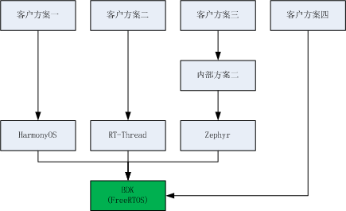
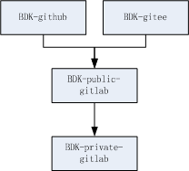
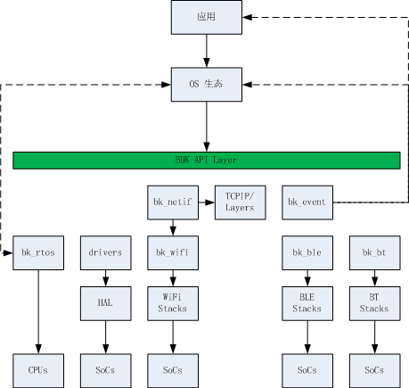
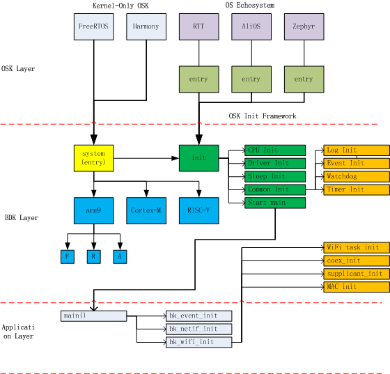
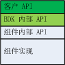
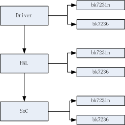
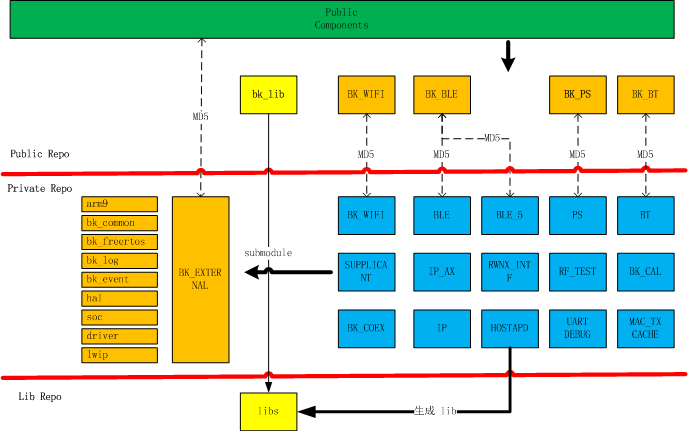

架构概述
===================

:link_to_translation:`en:[English]`

目标
---------------

高层目标：

 - 提高质量
 - 降低成本
 - 增加竞争力

技术目标：

 - 好用的 API
 - 好用的工具

     - 安装/下载/编译/烧录/调试/测试等
 - 专业的文档
 - 好扩充

     - 新增一个功能
     - 减少一个功能
     - 新增一块板子
     - 新增一种 CPU
     - 新增一种 OS
     - 第三方组件升级
 - 模块化
 - 高性能
 - 低成本
     - 内存
     - Flash
 - 低功耗
 - 拥抱开源
 - 一个 SDK

管理目标:

 - 专业的外部信息流通渠道
 - 专业的内部信息流通渠道
 - 高效的开发流程

整体架构
--------------

    Architecture Overview

如下图所示:

 - ARMINO 默认支持 FreeRTOS 系统
 - ARMINO 之上适配各种不同的 OS 生态系统
 - 

代码仓库
--------------

    Repo Overview

如上图所示, ARMINO Repo 分三层：

 - ARMINO-private-gitlab 用于存放内部私有组件，仅 Beken 特定开发人员在特定场所能访问
 - ARMINO-public-gitlab 用于存放 ARMINO 除私有组件之外的组件，即公开组件，仅 Beken ARMINO 开发人员能访问
 - ARMINO-github 与 ARMINO-gitee 为 ARMINO-public-gitlab 的镜像，对全球公开，所有人均可访问

ARMINO 架构
-------------

    Components Overview

如上图所示：

 - ARMINO 对外接口为 API 或者 Event
 - API 可为
 - bk_rtos 实现 OS 无所与 CPU 无关
 - Drivers 设计保证 SoC 无关
 - bk_wifi/bk_ble/bk_bt 保证协议栈提供统一，稳定的 API 与事件接口

模块化思想
------------------

模块化思想是 ARMINO 架构设计中最核心思想，通常包括下面一些观点：

 - 以组件形式组织与编译代码
 - 一个组件通常为一个库
 - 组件为发布最小单元
 - 组件提供一组定义良好的 API
 - 组件高度可配置
 - 组件可使能与关闭
 - 组件依赖关系定义良好

高层设计
------------------

初始化
*************

    ARMINO Init

如上图所示：

 - OS 生态初始化由具体 OS 生态提供，ARMINO 提供适配
 - FreeRTOS 初始化由 bk_system 提供
 - 初始化仅初始化最基本的组件
 - 应用相关组件初始化交由具体的应用完成

API 设计
*************

    ARMINO API

如上图所示，每个组件提供一组不同访问级别的 API:

 - 客户 API，要求稳定可靠，向后兼容，通常 beken 自研组件 API 头文件以 bk_api_xx.h 形式命名，放在组件的 include 目录下
 - ARMINO 内部 API，仅 ARMINO 内部组件可访问，不要求后向兼容，通常放在组件 include/bk_private 目录下
 - 组件内部 API，仅本组件 API 可访问，通常放在组件 include 目录之外的目录中

驱动框架
***********

    ARMINO Drivers

如下图所示：

 - Driver 层提供驱动模型，驱动 API，稳定抽象等机制
 - HAL 提供高性能硬件抽象接口
 - SoC 层提供寄存器封装

Public/Private Repo 设计
*********************************

    Public/Private Repo Communication

