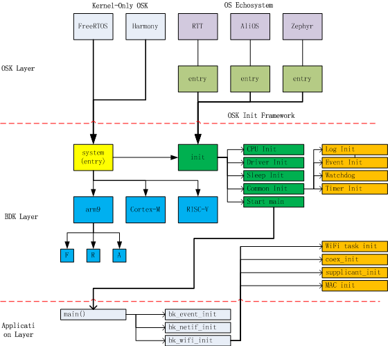

系统初始化
=========================================

:link_to_translation:`en:[English]`

.. note::

    本文档主要用于 ARMINO 开发者了解系统初始化流程。

概述
------------

    ARMINO Init Framework

ARMINO 初始化框架如上图所示。

初始化分层
******************

初始化由 OS/ARMINO/Application 一起完成，可简单理解成分三层，各层初始化职责如下：

+------------+----------------------------------------------------------------------+
| 层次       | 初始化                                                               |
+============+======================================================================+
| OSK Layer  |基于 ARMINO 的不同 OS，可分成两类:                                       |
|            |                                                                      |
|            |  - 只包含 kernel 的 OS，如 FreeRTOS 等， 这类 OS 不提供自己的初始化框|
|            |    架，因此 ARMINO 针对这类 OS 设计了专门的初始化组件 bk_system         |
|            |  - 包含 kernel 与完整的 OS 生态的 OS，如 RTT 等，这类 OS 通常有自己的|
|            |    初始化流程与框架，ARMINO 需要适配这些 OSK 的初始化流程               |
+------------+----------------------------------------------------------------------+
| ARMINO Layer  |ARMINO 主要完成下述初始化:                                               |
|            |                                                                      |
|            |  - OS 无关初始化                                                     |
|            |  - 应用无关初始化                                                    |
|            |  - 为只包含 Kernel 的 OS 提供初始化流程                              |
+------------+----------------------------------------------------------------------+
| Application|Application 完成与特定应用相关的初始化                                |
+------------+----------------------------------------------------------------------+

初始化流程
**************************

初始化流程可简单理解成如下：

 - bk_system 或 OSK 中初始化 OS
 - 初始化 ARMINO 最小组件
 - 初始化应用程序

初始化相关组件
-------------------------

bk_init
**********************

提供与 OS 无关的通用初始化代码，当前主要提供两个接口，供 bk_system 或者 OSK 的初始化代码调用：

 - components_init() 提供 OS 无关的最小组件初始化
 - legacy_init() 提供兼容 v3.0 版本的初始化

bk_system
**********************

为 FreeRTOS 等这些只有 kernel 的 OS 提供初始化，流程如下：

 - 调用 rtos_init() 完成 OS 初始化， 如 memory 初始化可封装在 rtos_init() 中。
 - 调用 components_init() 完成 OS 无关的最小组件初始化
 - 创建 main 任务

main
**********************

main 组件在应用代码中实现，主要完成应用程序相关的初始化。

arm9
**********************

提供 arm9 相关的初始化代码，其中特定 OS 相关的实际放在 arm9/os 目录下。

编程建议
---------------------------

为更好的支持多种不同 OS，不同 CPU，以及不同应用，建议：

 - ARMINO 各组件均应该提供 init/deinit 接口，即组件初始化接口
 - bk_init 只放置 OS 无关的初始化
 - 增加新 OS 时，如果 bk_init 组件中封装的初始化接口 components_init() 无关满足特定 OS 初始化时，在 OS 的初始化代码中直接组件初化接口
 - 增加新 CPU 时，新增与 arm9 类似组件

