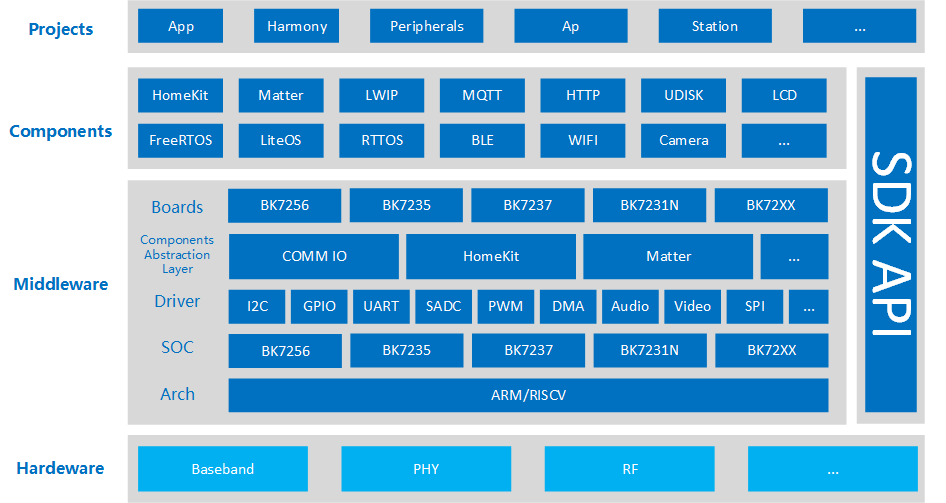
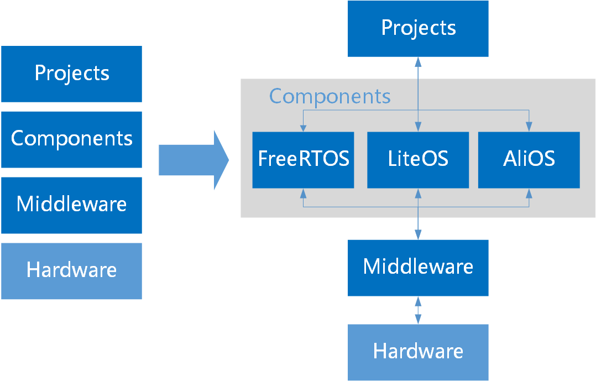
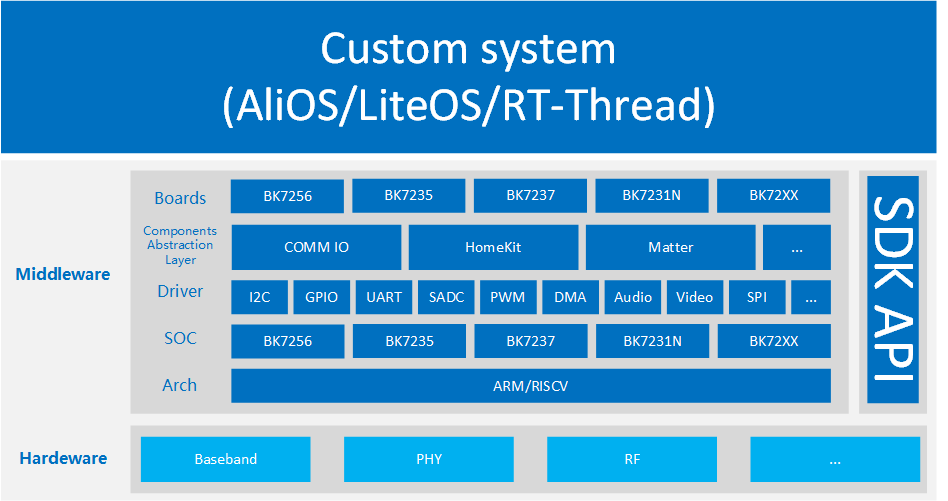
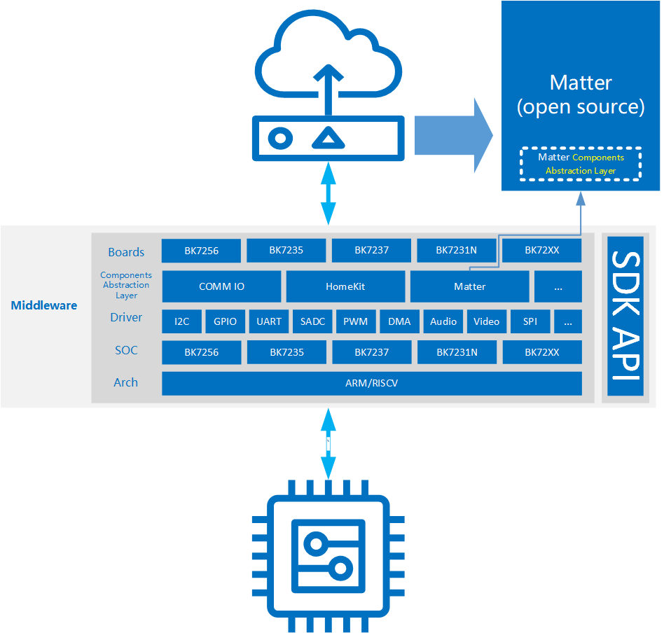

软件架构
-------------------------------------

:link_to_translation:`en:[English]`

概述
******************

    Armino软件，以中间层，组件层，工程层的组合形式，在硬件层面上，抽象层与层的关系，做到真正意义上的软件货架化。
	通过这种货架化设计，以及丰富的SDK API，给SDK开发者带来更高质量，更高效率的开发设计。

    Architecture Overview

解决方案
******************

    Armino，支持多种形式的解决方案
	一种，基于Armino SDK公开发布的解决方案。该解决方案整体框架，参见《Architecture Overview》图例。
	该解决方案中，我们已经添加了对不同操作系统的适配，将FreeRTOS，LiteOS作为Armino解决方案的货架化的其中一个选择。

    Armino OS solution

    另一种，基于开发者自己的软件架构，需要把我们的芯片解决方案，放到开发者自己的系统中。

    Armino customer solution

硬件层
******************

    Hardware层，即硬件层，这里具体指的是我们解决方案的硬件。

中间层
******************

    Middleware层，即中间层，它是针对底层硬件及上层组件的一类抽象层。通过中间层，我们在不同的解决方案中，无缝切换。

    Armino middleware

如图所示：
 - arch，包含了芯片架构的相关功能，如arm、riscv，通用中断处理，boot，pmp等。
 - soc，芯片相关特殊处理及相关配置。
 - dirver，驱动层，包含各种外设驱动，如I2C、GPIP、UART等。
 - compal，components abstraction layer，组件适配层。为了让第三方的开源组件，能够功能的运行在armino平台，同时又降低代码耦合度。
 - boards，板级配置相关，覆盖具体项目的一些工程配置。
 
组件层
******************

    Components层，即组件层，它是包含众多第三方开源，或者armino自行开发的服务组件。开发者可以通过在middleware层配置defconfig，开关相关的组件服务。
	
项目层
******************

    Porject层，即项目层，它是差异化，不同解决方案的配置集合。