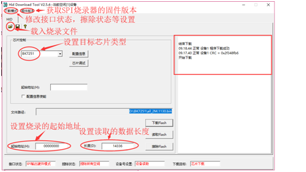

快速入门
=======================

:link_to_translation:`en:[English]`

本文档以 BK7231N 开发板为例，通过一个简单的示例项目向您展示

 - 如何安装 Armino 工具与依赖；
 - 以及如何配置 Armino 工程；
 - 如果编译、下载固件；

准备工作
------------------------

硬件：

 - BK7231N 开发板
 - 串口或者 SPI 烧录工具
 - 电脑（Windows 与 Ubuntu）

.. note::

  Armino 仅支持在 Linux 平台编译，仅支持在 Windows 平台进行固件烧录。因此，您需要两台电脑，一台 Linux 平台，一台 Windows 平台；
  当然，您也可以只使用 Windows 平台，在 Windows 平台上安装 Linux 虚拟机。

软件：

 - 工具链，用于编译 Armino；
 - 构建工具，包含 CMake 与 Ninja；
 - Armino 源代码；
 - 串口或者 SPI 烧录软件；

开发板简介
------------------------

点击下列链接了解 Armino 支持的开发板详细信息：

.. toctree::
    :maxdepth: 1

        BK7231N <../boards/bk7231n>
        BK7256 <../boards/bk7256>
        BK7271 <../boards/bk7271>

下载 Armino 代码
------------------------------------

您可从 github 上下载最新 Armino::

    mkdir -p ~/armino
    cd ~/armino
    git clone --recursive https://github.com/bekencorp/armino.git

您也可以从 Armino 其他镜像(TODO)下载 Armino。

安装工具
------------------------------------

.. note::

    本节安装命令为 Ubuntu 下安装命令，如果您需要在其他 Linux 平台下安装 Armino 依赖工具，请改成您使用平台所支持的安装命令。

安装并设置工具链
**************************

BK7231N 的工具链被打包放置在 armino/tools/toolchains/gcc-arm-none-eabi-5_4-2016q3-20160926-linux.tar.bz2 下，
在终端上输入下述命令将其放置到 /opt 下::

    $ sudo mkdir -p /opt/
    $ tar xf gcc-arm-none-eabi-5_4-2016q3-20160926-linux.tar.bz2 -C /opt/

.. note::

    如果您将工具链放置到其他目录下，那么在编译 Armino 时需要显式指定工具链绝对路径，例如: make bk7231n TOOLCHAIN_DIR=/usr/

安装构建工具
*****************

在终端输入下述命令安装 python3，CMake，Ninja 以及依赖库::

    sudo dpkg --add-architecture i386
    sudo apt-get update
    sudo apt-get install build-essential cmake python3 python3-pip doxygen ninja-build libc6:i386 libstdc++6:i386 libncurses5-dev lib32z1 -y

安装 PYTHON 依赖
*****************

在终端上输入如下命令安装文档编译所需要的 python 依赖::

    sudo pip3 install sphinx_rtd_theme future breathe blockdiag sphinxcontrib-seqdiag sphinxcontrib-actdiag sphinxcontrib-nwdiag

编译工程
------------------------------------

在终端下输入下述命令编译 Armino 默认工程，默认工程为启动 WiFi，BLE，初始化常见驱动，并启动 Armino 默认 Cli 程序::

    cd ~/armino
    make bk7231n

当然您也可以编译任何其他 armino/projects 下的工程，命令如下::

    cd ~/armino
    make bk7231n PROJECT=examples/get-started/hello_world

配置工程
------------------------------------

您可以通过 menuconfig 来更改 Armino 默认配置项::

    cd ~/armino
    make menuconfig

烧录代码
------------------------------------

在 Windows 平台上， Armino 目前支持 SPI 与 UART 两种不同的烧录方式。

通过 SPI 烧录
************************

SPI 烧录工具如下图所示:

.. figure:: ../../_static/download_tool_spi_flasher.png
    :align: center
    :alt: SPI Flasher
    :figclass: align-center

    SPI Flasher

您可以从 armino/tools 目录下获取 SPI 烧录工具为 BekenProgram.exe，或者去博通集成下载中心（TOOD）下载。

BekenProgram.exe 烧录界面及相关配置说明如下图所示：

    HID Download Tool GUI

点击``下载``进行烧录。

.. figure:: ../../_static/download_spi_step2.png
    :align: center
    :alt: SPI Download Progress
    :figclass: align-center

    SPI Download Progress

通过串口烧录
********************

.. note::

    仅支持 bootrom 或者 Flash 有 bootloader 的板子支持串口下载。推荐使用 CH340 串口进行下载。

串口烧录工具如下图所示:

    UART

您可以从 armino/tools 目录下获取串口烧录软件 bk_writer.exe，您也可以从博通集成下载中心下载最新串口烧录软件。

bk_writer.exe 界面及相关配置如下图所示：

.. figure:: ../../_static/download_uart_step1.png
    :align: center
    :alt: Bkwrite GUI
    :figclass: align-center

    bkwriter GUI

点击``烧录``进行版本烧录, 烧录完成之后掉电重起设备。

.. note::

  非 BK7231N 板子在烧录时，``start address`` 为 0x11000。
